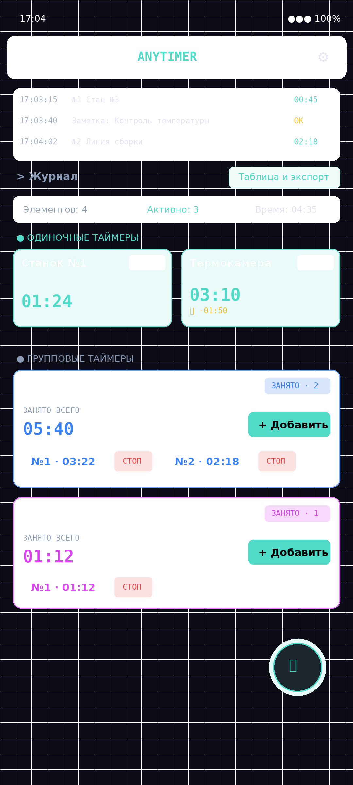
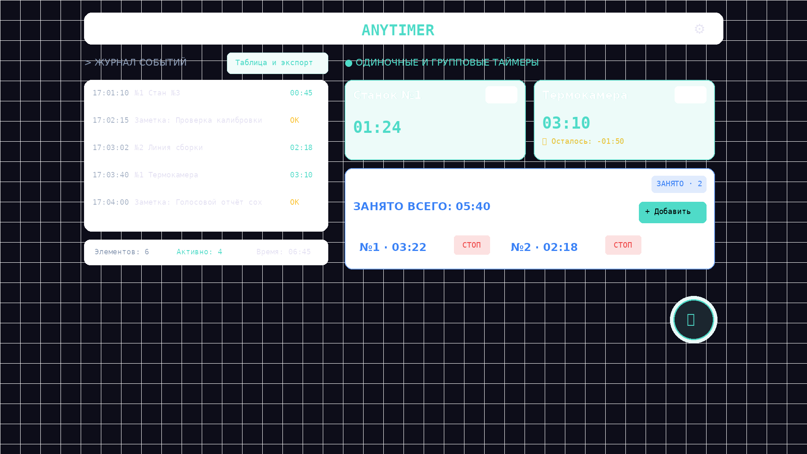

# AnyTimer ⏱️

**[🚀 Запустить онлайн (GitHub Pages)](https://astapovo.github.io/ANYTIMER/)**

Автономный, независимый от интернета PWA-хронометр для строгого параллельного контроля времени, процессов, оборудования и зон. Работает полностью локально на вашем устройстве без бэкенда и регистрации. Создан для инженеров, производственных цехов, полевых условий и оперативного управления на ходу.

<div align="center" style="margin: 20px 0;">
  
  
</div>

---

## 🌟 Ключевые возможности

### 1. 📱 100% Офлайн и PWA-приложение
* **Полная автономность:** Приложение устанавливается на рабочий стол смартфона (Android, iOS) или ПК (Windows, macOS, Linux) как нативная программа.
* **Работа без связи:** Кэширование всех ресурсов через Service Worker (v7). Работает в подвалах, бункерах и экранированных цехах.
* **Блокировка засыпания экрана (Screen Wake Lock):** Экран не гаснет, пока идёт отсчёт хотя бы одного таймера.

### 2. 🫧 Плавающая кнопка быстрых действий (Bubble FAB)
* **Удержание (Long-press ≥ 500 мс):** Мгновенно запускает голосовой набор заметки (Web Speech API).
* **Автоматическое приглушение музыки:** Во время голосовой диктовки фоновая музыка автоматически ставится на паузу и возобновляется после сохранения.
* **Кратковременный клик:** Открывает меню:
  * 🛠️ *Редактор элементов* — быстрый переход в конструктор.
  * 📝 *Создание заметок* — текстовый или голосовой ввод.
  * ↶ *Назад (Отмена)* и ↷ *Вперёд (Вернуть)* — мгновенная отмена и повтор любых действий (Undo/Redo).
* **Перетаскивание (Drag & Drop):** В режиме конструктора кнопку можно свободно перетащить в любое место экрана. Позиция сохраняется в памяти устройства.
* **Умное скрытие:** Бабл автоматически скрывается при открытии модальных окон и на экране восстановления сессии.

### 3. ⏱️ Два режима хронометража: Одиночный и Групповой
* **Одиночные таймеры:** Классический тумблер (Старт / Стоп) для индивидуального узла или операции.
* **Групповые таймеры:** Учет потока объектов (деталей, автотранспорта, персонала) в одной зоне. Каждое нажатие «+ Добавить» регистрирует новый объект с автоматическим номером (№1, №2...). Индивидуальная кнопка «Стоп» фиксирует финиш конкретного номера.

### 4. ⏳ Секундомер и Лимит обратного отсчёта
* **Секундомер:** Прямой отсчет времени от 00:00 вперёд.
* **Таймер с лимитом:** Установка точного дедлайна в формате **ЧЧ : ММ : СС**.
* **Действие по окончании лимита:**
  * 🔔 *Сигнал:* Звуковое и вибро-оповещение с индикацией превышения.
  * 🛑 *Авто-стоп:* Автоматическое завершение отсчета и запись финиша в журнал.
* **Групповые лимиты:** Применение персонального лимита к каждому объекту или общего лимита от момента старта первого вошедшего.

### 5. 📖 Встроенное интерактивное руководство
* Пункт **«Справка и руководство»** в меню настроек со структурированными вкладками:
  * 🚀 Быстрый старт за 3 шага.
  * 🫧 Жесты и интерактивный тренажер кнопки-бабла.
  * ⏱️ Режимы и лимиты.
  * 📝 Журнал, заметки и экспорт.
  * 💾 Пресеты и Webhooks.
  * 📲 Установка PWA и офлайн.

### 6. 📊 Журнал событий и Экспорт (CSV & Share)
* **Живая лента:** Отображение последних 5 событий прямо над рабочей зоной в реальном времени.
* **Полный протокол:** Детальная таблица со временем старта, финиша, номерами и длительностью.
* **Редактирование заметок:** Возможность редактировать текст или удалять заметки в истории.
* **Экспорт в CSV:** Файл оптимизирован для Microsoft Excel (кодировка UTF-8 BOM, запятые/кавычки, итоговая сводка суммарного времени по элементам).
* **Системный Share:** Отправка CSV-отчета в Telegram, WhatsApp, email в один клик.

### 7. 🌐 Автоматизация и Webhooks (Home Assistant / Node-RED)
Отправка событий POST JSON на указанный URL в реальном времени:
```json
{
  "event": "start | stop | arrive | depart | note",
  "zoneId": 0,
  "zoneName": "Станок №1",
  "localNum": 1,
  "durationMs": 84000,
  "text": "Текст заметки",
  "timestamp": "2026-08-31T15:04:00.000Z"
}
```

### 8. 💾 Пресеты и Надежное Автосохранение
* **Пресеты:** Сохранение наборов зон под разные задачи («Цех 1», «Склад», «Конвейер»), экспорт и импорт в `.json`.
* **Автосохранение:** Любое изменение сохраняется в `localStorage`. При случайном закрытии вкладки или браузера появляется экран восстановления с симметричными кнопками.
* **Защита от случайных нажатий:** Для процессов длиннее 30 минут запрашивается подтверждение перед остановкой.

---

## 🛠️ Стек технологий

* **Frontend:** Чистый Vanilla JavaScript (ES6+), HTML5, CSS3 Glassmorphism (без тяжёлых фреймворков).
* **Шрифты & Иконки:** [JetBrains Mono](https://fonts.google.com/specimen/JetBrains+Mono), [Lucide Icons](https://lucide.dev/).
* **Web API:** Service Worker API, Cache Storage API, Web Speech API (распознавание речи), Web Audio API (звуковые сигналы и фоновая музыка), Vibration API, Screen Wake Lock API, Web Share API.

---

## 📄 Лицензия

Распространяется под свободной лицензией MIT.
